---
# You can also start simply with 'default'
theme: seriph
# random image from a curated Unsplash collection by Anthony
# like them? see https://unsplash.com/collections/94734566/slidev
background: /MFT_background_1.png
# some information about your slides (markdown enabled)
title: Welcome to Slidev
# apply unocss classes to the current slide
class: text-center
# https://sli.dev/features/drawing
drawings:
  persist: false
# slide transition: https://sli.dev/guide/animations.html#slide-transitions
transition: slide-left
# enable MDC Syntax: https://sli.dev/features/mdc
mdc: true
lineNumbers: true
---

# Welcome to *Git*ting comfortable

A short introduction to Git

<div class="pt-12">
  <span @click="$slidev.nav.next" class="px-2 py-1 rounded cursor-pointer" hover="bg-white bg-opacity-10">
    Press Space or use keyboard arrows for next page <carbon:arrow-right class="inline"/>
  </span>
</div>

---

# What is git?

If you are completly new to git, then see the below video. If you know the basics, then continue onwards with the slides.

<iframe width="560" height="315" src="https://www.youtube.com/embed/USjZcfj8yxE?si=ArZewjdgoYvWBVlA" title="YouTube video player" frameborder="0" allow="accelerometer; autoplay; clipboard-write; encrypted-media; gyroscope; picture-in-picture; web-share" referrerpolicy="strict-origin-when-cross-origin" allowfullscreen></iframe>

---

# Basics of Git

Git is a version control system that helps you manage text files of all sorts in a collaborative and structured manner. <br>

The concept of git is that you work with a `repository` of which you can create `branches` (think shortlived variants of the codebase) that enables you to collaborate from the same point in time. You `commit` changes to a branch to create a record of your change for others and yourself to keep track of the history in changes. <br>

At the end you sync changes to a git server with `push` in order to save work and synchronize changes with your colleagues or automation systems.

```bash

git add <file> # Add a file to "staging"

git commit -m <message> # Records all changes that are staged by add with documentation on the work done in the files

git push -u origin <branch> # Push all missing commits from localhost (your machine) to a git server syncing your records with a server for collaboration

git checkout -b <branch> # Create and switch branch in a single command
```

---
layout: two-cols
---

# Basics of Git: Client-server

Git works as a client server paradigm 
<br>
<br>

Git works by a client (a user) cloning the source code from a `repository`, performing edits locally and pushing these edits to `origin` (the server from which you downloaded the source code). <br><br>
The benefit is here, that you can have multiple clients each with their own cloned repository, working on the same repo at the same time and continuously pushing code to origin.

::right::

<br>
<br>
<br>
<br>
<br>

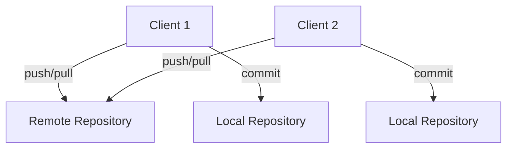

---
layout: two-cols-header
---

# Why Git?

Selling points:

::left::

<v-clicks>

- Multiple collaborators
  - 4 eyes principle

</v-clicks>

<v-clicks at=4>
<br>

*Joe; I like your change +1*

</v-clicks>

::right::

<div v-click> 

Git is an collaborative development solution that versions your code enabling multiple collaborators and pair-review processes built into the methodology.
</div>


<div v-click> 

```diff
public class Hello1
{
   public static void Main()
   {
-      System.Console.WriteLine("Hello, World!");
+      System.Console.WriteLine("Rock all night long!");
   }
}
```
</div>

<arrow v-click at=5 x1="250" y1="400" x2="550" y2="450" color="#953" width="2" arrowSize="1" />

---
layout: two-cols-header
---

# Why Git?

Selling points:

::left::

<div v-click at=1>

- Change history
  - Compliance
  - Reverting is easy
  - Versioning

</div v-click>

::right::
<div v-click at=2>
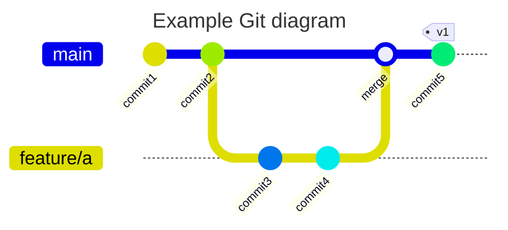
</div v-click>

<div v-click at=3>
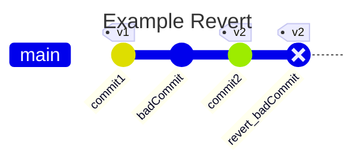
</div v-click>

---
layout:  two-cols-header
---

# Why Git

Selling points:

::left::

<div v-click at=1>

- Automation
  - Quality check
  - Deployment

</div v-click>


::right::

<v-click>

Another benefit of Git is that we can integrate the version control with <span v-mark.circle.orange="3">automation tooling</span> which continuously <span v-mark.circle.red="4">quality checks</span> your code.

</v-click>

<v-click at=5>
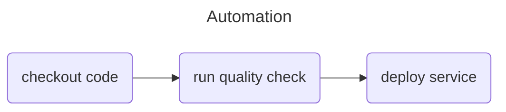
</v-click>
---

# Working with branches

Combining branches

When a change has been completed on a branch it is ready to be included in `main`. Combining two branches is referred to a *merging*. 
Before we dive into *how* to do it, it is important to talk about *when*. 

Ideally are branches short lived.
This means that we should strive to get meaningful changes merged back into `main` as quickly as possible.
A good rule of thumb is that branches should not live for more than two days.
In reality, this can be difficult to always do, but it is a good compass, none the less. 

Following our previous branch we can now go back to main
<v-switch>
<template #1>
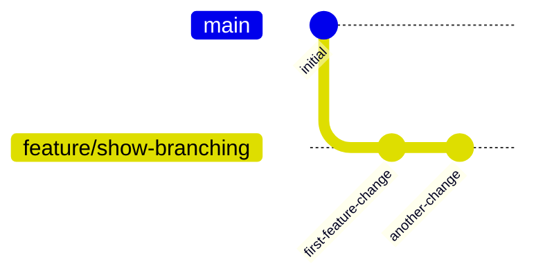
 </template>
<template #2>
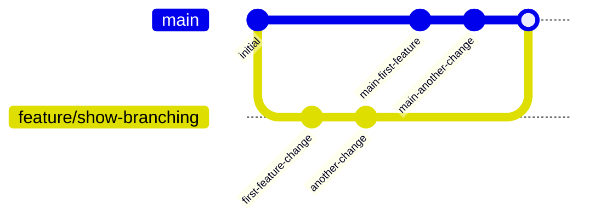
 </template>
</v-switch>

---

# Working with merges / rebasing - in realtion to Pull-Requests

<v-switch>
<template #1>
A Pull-Request is the process of raising awareness about a merge from a branch to a target branch, such as a feature branch to main. <br>
The Pull-Request facilitates things like discussions, change requests to edits, diff views, approvals etc - more on this later.

But most importantly it facilitates what happens when a Pull-Request is completed
</template>

<template #2>
There exists different methods of completing a Pull-Request;

1. No fast-forward
1. Fast-forward
1. Squash commit
1. Rebase with fast-forward or merge commit

</template>

<template #3>

**No fast-forward** is the method of not rewriting history and simply adding on top of the target branch.

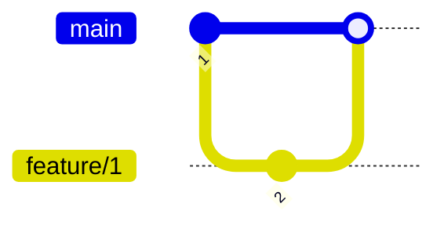

</template>

<template #4>

**Fast-forward** is the method of rewriting target branch to represent a linear history of events. In below graph you see a merge where the merged point is highlighted and represent a duplicate of the commit with id 2 that happened on the feature branch. If a git log is correctly drawn after the impact of the merge, the branch `feature/implement` will no longer be present in the git history.

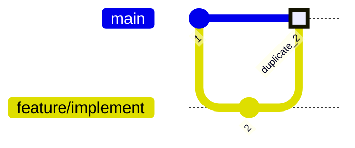

</template>

<template #5>

**Squash commit** is the method of squashing all your commits that happened on the feature branch to a single commit on the target. This method is much like fast-forward in the sense that the existence of the feature branch will be gone in relation to the history after the merge is complete. This method creates a very clean linear git history.


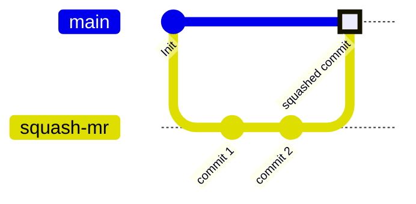

</template>

<template #6>

**Rebase** A rebase strategy works a in a sense reverse to how regular merges does. Instead of adding on top of the target branch, rebase takes each commit on the feature branch and merges one by one with the differences that happened on main since the feature branch got created.

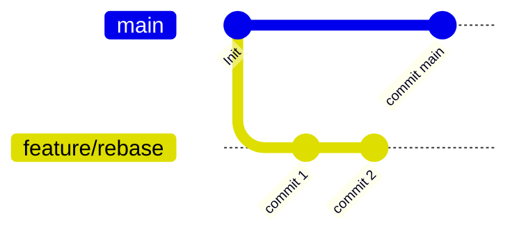

</template>

<template #7>
Rebase
<br>

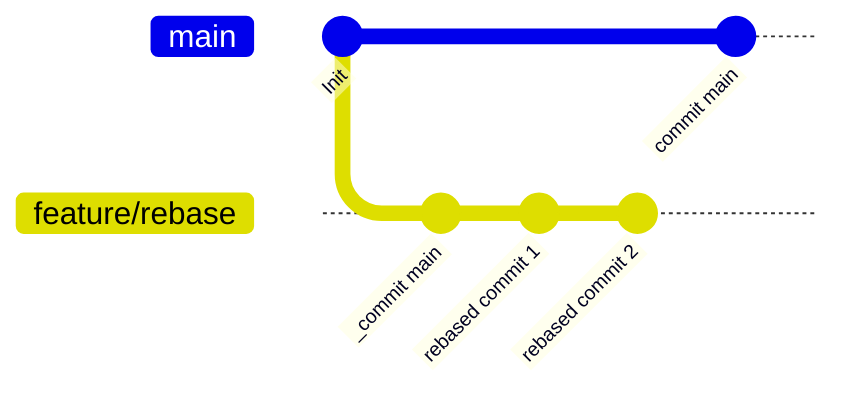

</template>

<template #8>
Rebase and merge
<br>

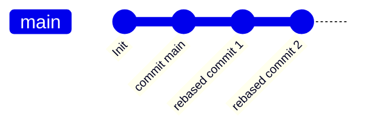

</template>

<template #9>

For more information on read the following topics;

1. [Merging vs Rebasing](https://www.atlassian.com/git/tutorials/merging-vs-rebasing#:~:text=Integrating%20an%20approved%20feature&text=However%2C%20by%20performing%20a%20rebase,added%20during%20a%20pull%20request.)
1. [Git merge](https://www.atlassian.com/git/tutorials/using-branches/git-merge)

</template>

</v-switch>

---

# Video on git merge / rebase

<iframe width="560" height="315" src="https://www.youtube.com/embed/0chZFIZLR_0?si=wXEsqrpC528IVvkj" title="YouTube video player" frameborder="0" allow="accelerometer; autoplay; clipboard-write; encrypted-media; gyroscope; picture-in-picture; web-share" referrerpolicy="strict-origin-when-cross-origin" allowfullscreen></iframe>

---

# Working with merges / rebasing - in realtion to local git

<v-switch>

<template #1>
It is not just at the git server we need to do merges / rebasing. These also happen locally, usually in order to synchronize a feature branch with changes from main before you create a pull request.

You can use the same methods as mentioned above locally, however there are a few rule-of-thumb's that we want to introduces:
</template>

<template #2>

**merge with fast-forward**<br>
Pull newest changes of main into your feature branch with fast-forward strategy. This is the safest and cleanest method next to rebase

```bash{2}
git checkout feature/branch
git pull origin main --ff
```

</template>

<template #3>

**rebase**<br>
Pull newest changes of main into your feature branch with rebase strategy. You can use this in-case fast-forward fails or you need to be more in control wil merge conflicts

```bash{2}
git checkout feature/branch
git pull origin main --rebase
```

</template>

<template #4>

**merge with merge commit**<br>
Pull newest changes of main into your feature branch with. You can use this in-case fast-forward fails or you need to be more in control wil merge conflicts

```bash{3}
git checkout feature/branch
git fetch main
git merge origin/main
```

</template>

</v-switch>

---

# Merge conflicts

When you are more than one participant on a git repository, then you will at some point run into a merge conflict. <br>

<v-switch>

<template #1>

Think of a scenario where you and a colleague both created a branch from main:

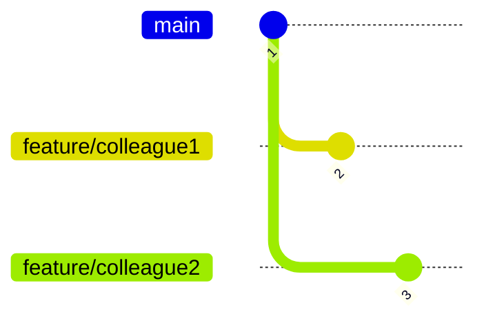

</template>

<template #2>

You both edited the same file `text.txt` on the same line 1:

(colleague1)
```diff

+echo "hello colleague1"

```

(colleague2)
```diff

+echo "hello colleague2"

```

</template>

</v-switch>

---

# Merge conflicts

When you are more than one participant on a git repository, then you will at some point run into a merge conflict. <br>

This will result in a conflict where both colleague1 and colleague2 have changed the exact same line on the exact same file;

```diff {all|3|5|all}
@@@ -1,1 -1,1 +1,5 @@@
++<<<<<<< HEAD
+echo "hello colleague1"
++=======
+ +echo "hello colleague2"
++>>>>>>> feature/colleague2
```

The diff is noted with all the special characters you in one block has what current revision marks as the "truth" and another block marks the incoming change as possible new "truth". Merge conflicts can happen both when doing local merge/rebase or when you open a PR. Often times the git server cannot handle merge conflicts for you, so you are required to do it locally.

Merge conflicts can be handled "easily" in your favorite IDE.

---


# Short video on git revert

<iframe width="560" height="315" src="https://www.youtube.com/embed/H2DuJNWbqLw?si=Ltw_X87fbonFOsqe" title="YouTube video player" frameborder="0" allow="accelerometer; autoplay; clipboard-write; encrypted-media; gyroscope; picture-in-picture; web-share" referrerpolicy="strict-origin-when-cross-origin" allowfullscreen></iframe>

---

# Reverting / Reset

You can end up in a situation where you find yourself in a detached head state or you simply committed to the wrong branch or similar. This is where [git revert](https://git-scm.com/docs/git-revert) or [git reset](https://git-scm.com/docs/git-reset) comes in handy.

<v-switch>

<template #1>

Lets say you ended up in a situation where you did not want to have committed the files anyway.

```diff

echo "hello world"
+ echo "I did not want this change to be in the file
```

</template>

<template #2>

Your git status says that you have one change yet to be synced:

```{2}
On branch feature/merge_strategies
Your branch is ahead of 'origin/feature/merge_strategies' by 1 commit.
  (use "git push" to publish your local commits)

nothing to commit, working tree clean
```

</template>

<template #3>

Then using git reset can help you get back to a point where you can edit the commit once again or scratch the commit entirely.

```bash
git reset --soft <commitid>
git reset --hard <commitid>
```

<br>

```bash
git reset --soft HEAD~1 # This will undo the latest commit happened on the current branch. 
  # --soft will make it so the edit is still changed and staged but not committed
```

<br>

```bash
git reset --hard HEAD~1 # This will undo the latest commit happened on the current branch. 
# --hard will make it so the edit of the commit is nowhere to be found anymore.
```

</template>

<template #4>

If you find yourself having commited and pushed the changes to a branch and you want to undo commit, then reset can be used, but it will be much cleaner to do a revert:

```bash
git revert <commitid>
```

<br>

```bash
git revert HEAD~1 # This will create a new commit undoing all changes from the latest commit on the branch
```

The main difference between revert and reset is that revert is for undoing changes with a new commit, whereas reset is mostly used before changes are synced with origin

</template>


</v-switch>

---

# Video on git stash

<iframe width="560" height="315" src="https://www.youtube.com/embed/lH3ZkwbVp5E?si=z4V07VS_zoSn5Qb0" title="YouTube video player" frameborder="0" allow="accelerometer; autoplay; clipboard-write; encrypted-media; gyroscope; picture-in-picture; web-share" referrerpolicy="strict-origin-when-cross-origin" allowfullscreen></iframe>

---

# Stashing changes

Git stashing is the method of saving your unstaged work for a later point. Often it can be used to save work in order to do a `git pull` or if you made changes on a branch that should not have been done from that revision.

Git stash works as a LIFO queue (last in - first out), where if you run `git stash push` then an entry is put into the cue with the current stages and unstaged changes. If you then run `git stash pop` then the edits you just put int op the queue are "popped" from the queue and the edits are present again.

```bash
git stash list # will list the current queue of stashed entries
git stash push # will push current edits into a stash entry for the queue
git stash list # Should now have a single entry in it
git stash pop # will remove the entry from the queue and apply the edits again in the local repo
```

---


# Time to do exercises!


- In the repo; https://github.com/mftenergy/Gitting-comfortable there are exercises
- Follow the path explained at https://github.com/mftenergy/Gitting-comfortable?tab=readme-ov-file#suggested-learning-path
- Path into an exercise directory, run `setup.sh` and read the README.md for instruction on what to do

```bash
cd basic-commits
./setup.sh
cat README.md
git magic
```

NOTE: There is a [cheatsheet](https://github.com/mftenergy/Gitting-comfortable?tab=readme-ov-file#cheatsheet) at the bottom of the README.md in the root of the repository.

You have two option;

1. **recommended** [Run in google cloud spaces (free)](https://console.cloud.google.com/cloudshell/editor?cloudshell_git_repo=https://github.com/mftenergy/git-course.git)
1. Run everything locally, if you choose that then read: [https://github.com/mftenergy/Gitting-comfortable/blob/main/setup-git/README.md](setup-git)
